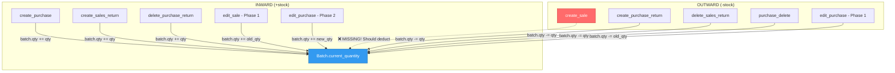
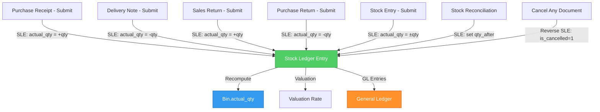

# 📦 Inventory Flow Research Report
## AgriCRM vs ERPNext — Stock Management Architecture

**Date:** 20-Feb-2026  
**Scope:** Full lifecycle analysis of how inventory (`Batch.current_quantity`) is created, mutated, and reconciled across Purchase, Sales, Returns, and Edit/Delete operations.

---

## Table of Contents

1. [Executive Summary](#1-executive-summary)
2. [AgriCRM: Current Inventory Flow](#2-agricrm-current-inventory-flow)
   - 2.1 Data Model
   - 2.2 Purchase → Stock Inward
   - 2.3 Sales → Stock Outward
   - 2.4 Sales Return → Stock Inward
   - 2.5 Purchase Return → Stock Outward
   - 2.6 Edit Operations
   - 2.7 Delete Operations
3. [ERPNext: Stock Management Architecture](#3-erpnext-stock-management-architecture)
   - 3.1 Core Concepts
   - 3.2 Stock Ledger Entry (SLE)
   - 3.3 Purchase Receipt → Stock Inward
   - 3.4 Delivery Note / Sales Invoice → Stock Outward
   - 3.5 Returns
   - 3.6 Stock Reconciliation
   - 3.7 Valuation Methods
4. [Side-by-Side Comparison](#4-side-by-side-comparison)
5. [🚨 Critical Bugs Discovered](#5-critical-bugs-discovered)
6. [Gap Analysis & Recommendations](#6-gap-analysis--recommendations)
7. [Flow Diagrams](#7-flow-diagrams)

---

## 1. Executive Summary

| Aspect | AgriCRM | ERPNext |
|--------|---------|---------|
| **Stock Tracking** | Direct field mutation (`Batch.current_quantity +=/-=`) | Immutable ledger entries (`Stock Ledger Entry`) |
| **Audit Trail** | ❌ None — qty is overwritten in-place | ✅ Full — every movement is a timestamped SLE row |
| **Stock Deduction on Sale** | ⚠️ **MISSING** — see Bug #1 | ✅ Automatic via SLE on Delivery Note/Sales Invoice submit |
| **Valuation Method** | Flat `purchase_price` per batch | FIFO or Moving Average per item/warehouse |
| **Warehouse Support** | ❌ Single implicit warehouse | ✅ Multi-warehouse with inter-warehouse transfers |
| **Document Lifecycle** | No draft/submit/cancel states | Draft → Submit → Cancel (with amendments) |
| **GL Integration** | ❌ No accounting entries | ✅ Perpetual inventory → automatic GL entries |
| **Negative Stock Prevention** | Partial (only on sales `clean()`) | Configurable per-company policy |

---

## 2. AgriCRM: Current Inventory Flow

### 2.1 Data Model

```
Batch (inventory/models.py)
├── product          → FK to Product
├── batch_number     → CharField
├── manufacturing_date, expiry_date
├── purchase_price   → DecimalField  (net cost per unit incl. tax)
├── mrp, base_selling_price
├── current_quantity → IntegerField  ← THE SINGLE SOURCE OF TRUTH
├── size, unit
├── is_active
└── @property days_to_expiry
```

**Key Observation:** `current_quantity` is the ONLY place stock level exists. It is mutated directly by views with `batch.current_quantity += qty` / `batch.current_quantity -= qty`. There is NO separate ledger table that records individual stock movements.

---

### 2.2 Purchase → Stock Inward (creates inventory)

**File:** `transactions/views.py` → `create_purchase()`  
**Lines:** 951-1100

```
┌─────────────────────────────────────────────────────┐
│                 create_purchase()                     │
│                                                       │
│  1. Create PurchaseInvoice (header)                   │
│  2. For each item row:                                │
│     a. Batch.objects.get_or_create(                    │
│           product, batch_number, mrp                  │
│        )                                              │
│     b. If batch exists: update metadata               │
│        (mfg_date, expiry, purchase_price)             │
│     c. batch.current_quantity += qty  ← STOCK IN      │
│     d. batch.save()                                   │
│     e. Create PurchaseItem row                        │
│  3. Calculate grand_total                             │
│  4. Set payment_status (UNPAID/PARTIAL/PAID)          │
│  5. invoice.save()                                    │
└─────────────────────────────────────────────────────┘
```

**Batch Identity:** get_or_create uses `(product, batch_number, mrp)` as the unique key. If you purchase the same batch at a different MRP, it creates a NEW Batch record.

**Stock Impact:** `batch.current_quantity += qty` — direct, immediate, no ledger entry.

---

### 2.3 Sales → Stock Outward

**File:** `transactions/views.py` → `create_sale()`  
**Lines:** 194-306

```
┌─────────────────────────────────────────────────────┐
│                   create_sale()                       │
│                                                       │
│  1. Create SalesInvoice (header, totals = 0)          │
│  2. For each item row:                                │
│     a. batch = Batch.objects.get(id=batch_id)         │
│     b. Create SalesItem(batch, qty, price, tax...)    │
│     c. item.clean()   ← Validates stock available     │
│     d. item.save()    ← JUST SAVES, DOES NOT          │
│                          DEDUCT STOCK!                │
│  3. Update invoice totals                             │
│  4. Create optional CustomerPayment                   │
│  5. Redirect to dashboard                             │
└─────────────────────────────────────────────────────┘
```

### 🚨 CRITICAL BUG #1: No Stock Deduction on Sales

The code on line 245 has a comment:
```python
# Create Item (Signals will handle stock deduction)
```

**But there is NO signal for stock deduction.** The only signals in `transactions/signals.py` are:
- `update_sales_invoice_payment_status` — handles **payment/wallet** updates
- `update_invoice_payment_status` — handles **supplier payment** updates

Neither signal touches `Batch.current_quantity`. The `SalesItem` model has:
- `clean()` → validates stock is available (correct ✅)
- `save()` → Django default save, does NOT override to deduct stock (❌)

**Impact:** When a sale is made, `Batch.current_quantity` is NEVER reduced. Stock levels are permanently inflated. The validation in `clean()` still works (it checks `current_quantity` before saving), but the actual deduction never happens.

**Contrast with edit_sale():** The `edit_sale()` view DOES manually restore stock:
```python
# Line 411: Restore stock from old items
for item in invoice.items.all():
    item.batch.current_quantity += item.quantity  # puts back old qty
    item.batch.save()
    item.delete()
```
But it relies on the same broken `item.save()` for the new items — so edits also fail to deduct stock.

---

### 2.4 Sales Return → Stock Inward

**File:** `transactions/views.py` → `create_sales_return()`  
**Lines:** 1276-1391

```
┌─────────────────────────────────────────────────────┐
│             create_sales_return()                     │
│   Direction: INWARD (customer returns to shop)        │
│                                                       │
│  1. Create SalesReturn record                         │
│  2. For each returned item:                           │
│     a. Create SalesReturnItem                         │
│     b. batch.current_quantity += qty  ← STOCK IN ✅   │
│     c. batch.save()                                   │
│  3. Calculate refund_amount                           │
│  4. Create CustomerPayment:                           │
│     - If linked to invoice → SALES_RETURN mode        │
│       (settles invoice balance directly)              │
│     - If not linked → WALLET_CREDIT mode              │
│       (credits customer wallet via signal)            │
└─────────────────────────────────────────────────────┘
```

**Deletion reversal** (`delete_sales_return`, line 1400):
1. For each item: `batch.current_quantity -= item.quantity` (undo stock add)
2. Delete linked `CustomerPayment` (signal handles wallet/invoice reversal)
3. Delete `SalesReturn` record

---

### 2.5 Purchase Return → Stock Outward

**File:** `transactions/views.py` → `create_purchase_return()`  
**Lines:** 1437-1517

```
┌─────────────────────────────────────────────────────┐
│            create_purchase_return()                    │
│   Direction: OUTWARD (return to supplier)             │
│                                                       │
│  1. Create PurchaseReturn record                      │
│  2. For each returned item:                           │
│     a. Validate: qty <= batch.current_quantity         │
│     b. batch.current_quantity -= qty  ← STOCK OUT ✅  │
│     c. batch.save()                                   │
│     d. Create PurchaseReturnItem                      │
│  3. Create SupplierPayment (DEBIT_NOTE mode)          │
│     → Signal updates invoice balance_due              │
└─────────────────────────────────────────────────────┘
```

**Deletion reversal** (`delete_purchase_return`, line 1526):
1. For each item: `batch.current_quantity += item.quantity` (restore stock)
2. Delete linked `SupplierPayment` (signal handles invoice balance reversal)
3. Delete `PurchaseReturn` record

---

### 2.6 Edit Operations

#### Purchase Edit (`purchase_edit`, line 720)

```
┌─────────────────────────────────────────────────────┐
│              purchase_edit() — POST                   │
│                                                       │
│  Phase 1: UNDO old items                              │
│  ├── for item in invoice.items.all():                 │
│  │   ├── batch.current_quantity -= item.quantity  ← ↓ │
│  │   ├── batch.save()                                 │
│  │   └── item.delete()                                │
│  │                                                    │
│  Phase 2: CREATE new items (same as create_purchase)  │
│  ├── for each row:                                    │
│  │   ├── Batch.get_or_create(...)                     │
│  │   ├── batch.current_quantity += qty  ← ↑           │
│  │   ├── batch.save()                                 │
│  │   └── PurchaseItem.objects.create(...)              │
│  └── invoice.save()                                   │
└─────────────────────────────────────────────────────┘
```

**Pattern:** "Delete-and-Recreate" — destroys all old items (reversing their stock), then creates new items (adding stock). This is simple but loses history.

#### Sales Edit (`edit_sale`, line 372)

Same "Delete-and-Recreate" pattern:
1. Restore stock: `batch.current_quantity += item.quantity` for all old items
2. Delete old items
3. Create new items via `SalesItem.save()` 
4. ⚠️ Stock deduction for new items is MISSING (same Bug #1)

---

### 2.7 Delete Operations

#### Purchase Delete (`purchase_delete`, line 922)

```python
for item in invoice.items.all():
    item.batch.current_quantity -= item.quantity  # Reverse stock
    item.batch.save()
invoice.delete()  # CASCADE deletes PurchaseItems
```

**Risk:** Can make `current_quantity` go **negative** — no guardrail check.

#### Sales Invoice Delete (`delete_invoice`, line 348)

```python
# Refunds wallet payments first
for payment in invoice.payments.filter(amount__gt=0):
    if payment.payment_mode == 'WALLET':
        customer.wallet_balance += payment.amount

# Delete payments (reversals first, then originals)
invoice.payments.filter(reversal_of__isnull=False).delete()
invoice.payments.all().delete()

invoice.delete()  # CASCADE deletes SalesItems
```

**Note:** Because **Bug #1** means stock was never deducted on sale, deleting the invoice does NOT need to restore stock (and it doesn't try to). This is "accidentally consistent" — both sides of the bug cancel out.

---

## 3. ERPNext: Stock Management Architecture

### 3.1 Core Concepts

ERPNext uses a **fundamentally different architecture** for stock management:

```
┌──────────────────────────────────────────────────────────────┐
│                    ERPNext Stock Architecture                  │
│                                                                │
│  ┌──────────┐    ┌──────────────────┐    ┌──────────────────┐ │
│  │ Purchase  │───▶│ Stock Ledger     │───▶│  Bin             │ │
│  │ Receipt   │    │ Entry (SLE)      │    │ (Actual Qty)     │ │
│  └──────────┘    │                  │    └──────────────────┘ │
│                  │  item_code       │                          │
│  ┌──────────┐   │  warehouse       │    ┌──────────────────┐ │
│  │ Delivery │───▶│  actual_qty (+/-) │───▶│  GL Entry        │ │
│  │ Note     │    │  valuation_rate  │    │ (Perpetual Inv.) │ │
│  └──────────┘    │  qty_after_txn   │    └──────────────────┘ │
│                  │  posting_date    │                          │
│  ┌──────────┐   │  voucher_type    │                          │
│  │ Stock    │───▶│  voucher_no      │                          │
│  │ Entry    │    └──────────────────┘                          │
│  └──────────┘                                                  │
└──────────────────────────────────────────────────────────────┘
```

### 3.2 Stock Ledger Entry (SLE)

The **Stock Ledger Entry** is the heart of ERPNext's inventory system. It is an **append-only, immutable ledger** — like a bank statement for stock.

Key fields on each SLE:
| Field | Purpose |
|-------|---------|
| `item_code` | Which item |
| `warehouse` | Which warehouse |
| `actual_qty` | Change amount (+ve = inward, -ve = outward) |
| `qty_after_transaction` | Running balance after this entry |
| `valuation_rate` | Computed valuation per unit at this point |
| `stock_value` | Total value of stock at this point |
| `stock_value_difference` | Change in stock value from this entry |
| `voucher_type` | Source document (Purchase Receipt, Delivery Note, etc.) |
| `voucher_no` | Source document ID |
| `posting_date` + `posting_time` | When the movement happened |
| `is_cancelled` | Soft-delete flag for cancellations |

**Key insight:** ERPNext NEVER directly mutates a quantity field. Instead, it creates a new SLE row. The current stock is always the sum of all non-cancelled SLE rows (or the `qty_after_transaction` on the latest SLE).

### 3.3 Purchase Receipt → Stock Inward

```
Document Lifecycle:
  Draft → (validate) → Submit → (on_submit hook) → Create SLE(s)

on_submit():
  ├── update_stock_ledger()  
  │   └── For each item:
  │       └── SLE.create(actual_qty = +received_qty,
  │                      warehouse = target_warehouse,
  │                      incoming_rate = purchase_rate)
  ├── make_gl_entries()     ← Accounting (Perpetual Inventory)
  │   └── Debit:  Stock In Hand (Asset)
  │       Credit: Stock Received But Not Billed (Liability)
  └── update_status_updater() ← Updates Purchase Order "received_qty"
```

**On Cancel:**
```
on_cancel():
  ├── Creates REVERSE SLE (actual_qty = -received_qty, is_cancelled=1)
  ├── Reverse GL entries
  └── Update Purchase Order status
```

### 3.4 Delivery Note / Sales Invoice → Stock Outward

Stock is deducted when a **Delivery Note** is submitted (or when a Sales Invoice with "Update Stock" is submitted):

```
on_submit():
  └── update_stock_ledger()
      └── For each item:
          └── SLE.create(actual_qty = -delivered_qty,
                         warehouse = source_warehouse,
                         outgoing_rate = valuation_rate)
```

### 3.5 Returns

ERPNext handles returns as **negative-quantity documents**:

- **Sales Return** = Delivery Note with `is_return = 1` → `actual_qty = +qty` (stock comes back in)
- **Purchase Return** = Purchase Receipt with `is_return = 1` → `actual_qty = -qty` (stock goes out)

The same SLE mechanism handles both — just with flipped sign.

### 3.6 Stock Reconciliation

ERPNext has a dedicated **Stock Reconciliation** document for adjustments (physical counts, damage, corrections). This creates a SLE that sets `qty_after_transaction` to the target value.

### 3.7 Valuation Methods

ERPNext supports per-item valuation:
- **FIFO** (First In, First Out) - default
- **Moving Average** 
- **LIFO** (Last In, First Out)

The `stock_ledger.py` `process_sle()` method recomputes valuation rate after each SLE entry using a queue-based FIFO or weighted average calculation. This gives accurate COGS for every sale.

---

## 4. Side-by-Side Comparison

### Architecture Pattern

| Aspect | AgriCRM | ERPNext |
|--------|---------|---------|
| **Pattern** | "Direct Mutation" | "Event Sourcing / Ledger" |
| **Stock Storage** | Single `current_quantity` field on `Batch` | `Stock Ledger Entry` table (append-only) + `Bin` table (cache) |
| **Stock Update** | `batch.current_quantity += qty` in view code | `SLE.create(actual_qty=+qty)` → recompute `Bin` |
| **History** | Lost — overwritten each time | Complete — every SLE is permanent |
| **Can Reconstruct** | ❌ No way to see what happened | ✅ Full replay from any point |

### Purchase Flow

| Step | AgriCRM | ERPNext |
|------|---------|---------|
| Document | `PurchaseInvoice` (direct save) | `Purchase Receipt` (Draft → Submit) |
| Batch/Item | `Batch.get_or_create()` by (product, batch_no, mrp) | Item + Batch doctype (separate master data) |
| Stock Update | `batch.current_quantity += qty` in view | SLE on submit: `actual_qty = +qty` |
| Undo (Cancel) | `batch.current_quantity -= qty` + hard delete | Reverse SLE (`is_cancelled=1`) + status change |
| Edit | Delete-and-Recreate (destructive) | Amend: Cancel → create new amended doc |

### Sales Flow

| Step | AgriCRM | ERPNext |
|------|---------|---------|
| Document | `SalesInvoice` (direct save) | `Delivery Note` or `Sales Invoice` (with Update Stock) |
| Stock Validation | `SalesItem.clean()` checks qty | Validates against `Bin.actual_qty` on submit |
| Stock Deduction | **❌ MISSING (Bug #1)** | SLE on submit: `actual_qty = -qty` |
| Financial | `CustomerPayment` + signal for wallet | GL entries (Perpetual Inventory) |

### Returns Flow

| Step | AgriCRM | ERPNext |
|------|---------|---------|
| Sales Return | Separate `SalesReturn` model + manual `qty += ` | Delivery Note with `is_return=1` → SLE `actual_qty = +qty` |
| Purchase Return | Separate `PurchaseReturn` model + manual `qty -= ` | Purchase Receipt with `is_return=1` → SLE `actual_qty = -qty` |
| Deletion | Reverse stock manually + delete record | Cancel document → reverse SLE (immutable) |
| Returned Qty Tracking | `already_returned` calculated via aggregate query | `returned_qty` field on original document row |

### Edit & Delete

| Operation | AgriCRM | ERPNext |
|-----------|---------|---------|
| Edit | "Delete-and-Recreate" — destroys old items, creates new | **No direct edit.** Cancel + Amend creates a new linked doc |
| Delete Purchase | Hard delete + reverse stock (can go negative) | Cancel → document persists with `docstatus=2` |
| Delete Sale | Hard delete + wallet refund (stock never deducted anyway) | Cancel → reverse SLE + GL entries |
| Audit Trail | ❌ Nothing remains after delete | ✅ Cancelled doc + cancellation SLEs remain |

---

## 5. 🚨 Critical Bugs Discovered

### Bug #1: Sales Do NOT Deduct Stock (CRITICAL)

**Location:** `transactions/views.py` line 245-257  
**Severity:** 🔴 **CRITICAL** — Inventory levels are permanently wrong

**Code Path:**
```python
# Line 245: Comment says "Signals will handle stock deduction"
item = SalesItem(...)
item.clean()  # ✅ Validates qty (works correctly)
item.save()   # ❌ No stock deduction happens here!
```

**Evidence:**
- `SalesItem` model has NO `save()` override
- `transactions/signals.py` has NO signal for `SalesItem` post_save
- No signal anywhere in the project handles stock deduction for sales

**Impact:**
- `Batch.current_quantity` is NEVER reduced when goods are sold
- Stock reports show inflated quantities
- Over time, `current_quantity` only goes UP (from purchases and sales returns) but never DOWN
- The `clean()` validation still works because it checks the (incorrectly high) `current_quantity`

**Recommended Fix:**
```python
# Option A: Add to SalesItem.save() override
def save(self, *args, **kwargs):
    is_new = self.pk is None
    super().save(*args, **kwargs)
    if is_new:
        self.batch.current_quantity -= self.quantity
        self.batch.save()

# Option B: Add Django signal
@receiver(post_save, sender=SalesItem)
def deduct_stock_on_sale(sender, instance, created, **kwargs):
    if created:
        instance.batch.current_quantity -= instance.quantity
        instance.batch.save()
```

### Bug #2: Purchase Delete Can Create Negative Stock

**Location:** `transactions/views.py` line 922-935

```python
# Line 928: No validation before deducting
item.batch.current_quantity -= item.quantity  # Can go negative!
item.batch.save()
```

If some of the purchased stock has already been sold (via returns, or if Bug #1 is fixed), deleting the purchase can push `current_quantity` below zero.

**ERPNext's approach:** Validates against negative stock before allowing cancellation. If `allow_negative_stock` is disabled, cancellation is blocked.

### Bug #3: Race Condition on Stock Updates

All stock mutations use the pattern:
```python
batch = Batch.objects.get(id=batch_id)
batch.current_quantity += qty
batch.save()
```

This is vulnerable to **race conditions** — two concurrent requests can both read the same `current_quantity`, add to it, and the last save wins (lost update).

**ERPNext's approach:** Uses database-level `FOR UPDATE` locks and transactional SLE processing.

**Recommended Fix:**
```python
# Use Django F() expressions for atomic updates
Batch.objects.filter(id=batch_id).update(
    current_quantity=F('current_quantity') + qty
)
```

---

## 6. Gap Analysis & Recommendations

### Priority 1: Fix Stock Deduction (Critical)

Add a `post_save` signal for `SalesItem` that deducts stock. Also need a `post_delete` signal that restores stock:

```python
@receiver(post_save, sender=SalesItem)
def deduct_stock_on_sale(sender, instance, created, **kwargs):
    if created:
        Batch.objects.filter(pk=instance.batch_id).update(
            current_quantity=F('current_quantity') - instance.quantity
        )
```

### Priority 2: Stock Movement Ledger (Medium-Term)

Create a `StockMovement` model that records every stock change:

```python
class StockMovement(models.Model):
    batch = models.ForeignKey(Batch, on_delete=models.CASCADE)
    movement_type = models.CharField(choices=[
        ('PURCHASE', 'Purchase'),
        ('SALE', 'Sale'),
        ('SALES_RETURN', 'Sales Return'),
        ('PURCHASE_RETURN', 'Purchase Return'),
        ('ADJUSTMENT', 'Adjustment'),
    ])
    quantity = models.IntegerField()  # +ve = inward, -ve = outward
    balance_after = models.IntegerField()
    reference_type = models.CharField()  # 'PurchaseInvoice', 'SalesInvoice', etc.
    reference_id = models.IntegerField()
    created_at = models.DateTimeField(auto_now_add=True)
```

This gives audit trail without the full complexity of ERPNext's SLE system.

### Priority 3: Negative Stock Prevention

Add a constraint or validation:
```python
class Batch(models.Model):
    class Meta:
        constraints = [
            models.CheckConstraint(
                check=models.Q(current_quantity__gte=0),
                name='batch_non_negative_stock'
            )
        ]
```

### Priority 4: Atomic Stock Updates

Replace all `batch.current_quantity += qty` / `batch.save()` with F() expressions:
```python
Batch.objects.filter(pk=batch_id).update(
    current_quantity=F('current_quantity') + qty
)
```

---

## 7. Flow Diagrams

### AgriCRM: Complete Stock Flow



### ERPNext: Stock Ledger Flow



### Summary of All Stock Mutations in AgriCRM

| Operation | Function | Line | Direction | Working? |
|-----------|----------|------|-----------|----------|
| Create Purchase | `create_purchase()` | 1071 | +qty ↑ | ✅ |
| Create Sale | `create_sale()` | 257 | -qty ↓ | ❌ **MISSING** |
| Edit Purchase (undo) | `purchase_edit()` | 804 | -qty ↓ | ✅ |
| Edit Purchase (redo) | `purchase_edit()` | 871 | +qty ↑ | ✅ |
| Edit Sale (undo) | `edit_sale()` | 411 | +qty ↑ | ✅ |
| Edit Sale (redo) | `edit_sale()` | 459 | -qty ↓ | ❌ **MISSING** |
| Delete Purchase | `purchase_delete()` | 928 | -qty ↓ | ⚠️ No negative check |
| Delete Sale | `delete_invoice()` | 367 | none | ⚠️ No stock restore (but never deducted) |
| Sales Return | `create_sales_return()` | 1350 | +qty ↑ | ✅ |
| Delete Sales Return | `delete_sales_return()` | 1411 | -qty ↓ | ✅ |
| Purchase Return | `create_purchase_return()` | 1481 | -qty ↓ | ✅ (with validation) |
| Delete Purchase Return | `delete_purchase_return()` | 1536 | +qty ↑ | ✅ |

---

*End of Report*
